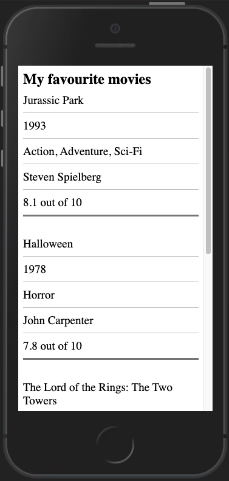
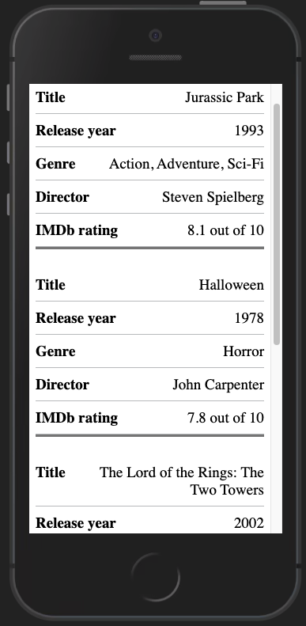

Tables on mobile can sometimes be not the most user-friendly experience. That might be because of horizontal scrolling or endlessly trying to resize content and hoping it fits a 320px viewport.
Fortunately, there is another way.

If you want to check out the HTML and CSS you can [view on Codepen](https://codepen.io/Fenwick17/pen/RwReYXM), [view on Github](https://github.com/Fenwick17/responsive-accessible-table), or [view the example](https://fenwick17.github.io/responsive-accessible-table/).

## The table

When viewed on a desktop, the table component will behave like any other table. When viewed on a mobile, the table collapses into  a grouped list-style component.

The markup remains the same regardless of screen size or device. When using a screen reader they will still read it out as if it was a normal table but with a different visual representation.

### How it works

Let's start by building our barebones HTML table: 
```html
<table class="responsive-table">
  <caption>Table of my favourite movies</caption>
  <thead>
    <tr>
      <th scope="col">Title</th>
      <th scope="col">Release year</th>
      <th scope="col">Genre</th>
      <th scope="col">Director</th>
      <th scope="col">IMDb rating</th>
    </tr>
  </thead>
  <tbody>
    <tr>
      <td>Jurassic Park</td>
      <td>1993</td>
      <td>Action, Adventure, Sci-Fi</td>
      <td>Steven Spielberg</td>
      <td>8.1 out of 10</td>
    </tr>
    <tr>
      <td>Halloween</td>
      <td>1978</td>
      <td>Horror</td>
      <td>John Carpenter</td>
      <td>7.8 out of 10</td>
    </tr>
    <tr>
      <td>The Lord of the Rings: The Two Towers</td>
      <td>2002</td>
      <td>Adventure</td>
      <td>Peter Jackson</td>
      <td>8.7 out of 10</td>
    </tr>
    <tr>
      <td>Anchorman: The Legend of Ron Burgundy</td>
      <td>2004</td>
      <td>Comedy</td>
      <td>Adam McKay</td>
      <td>7.2 out of 10</td>
    </tr>
  </tbody>
</table>
```

And of course our default CSS, nothing fancy here so change it however you would like.
```css
table {
  border-collapse: collapse;
  border-spacing: 0;
}
  
caption { 
  font-size: 24px;
  font-weight: 700;
  text-align: left;
}
  
th {
  border-bottom: 1px solid #bfc1c3;
  font-size: 19px;
  padding: 0.5em 1em 0.5em 0;
  text-align: left;
}
  
td {
  border-bottom: 1px solid #bfc1c3;
  font-size: 19px;
  padding: 0.5em 1em 0.5em 0;
}
```
Now we have a standard table, this is the perfect starting point. Let's get down to the fun stuff and add our responsiveness.

On mobile, we are going to change our table rows to be block-level rather than table-row. Since that will break the alignment with the table heading, we can visually hide that too. We do not use `display: none` here as we need this to remain available for screen readers at all times. 

```css
.responsive-table {
  margin-bottom: 0;
  width: 100%;
}

thead {
  border: 0;
  clip: rect(0 0 0 0);
  -webkit-clip-path: inset(50%);
  clip-path: inset(50%);
  height: 1px;
  margin: 0;
  overflow: hidden;
  padding: 0;
  position: absolute;
  white-space: nowrap;
  width: 1px;
}

tbody tr {
  display: block;
  margin-bottom: 1.5em;
  padding: 0 0.5em;
}

@media (min-width: 768px) {
  tbody tr {
    display: table-row;
  }
}
```
Now we need to get our mobile version remotely resembling a list. To do that, we add `flex` to our `<td>` (this will make more sense later on). I like to add a `border-bottom` to the last `<td>`, this is entirely optional, I think it breaks things up a bit nicer. And then back to the default `table-cell` on a desktop.

```css
tbody tr td {
  display: flex;
  justify-content: space-between;
  min-width: 1px;
  text-align: right;
}

@media (max-width: 768px) {
  tbody tr td {
    padding-right: 0;
  }
  tbody tr td:last-child {
    border-bottom: 3px solid grey;
  }
}

@media (min-width: 768px) {
  tbody tr td {
    display: table-cell;
    text-align: left;
  }
}
```

  

We changed the `display` styling for `<tr>` and `<td>` which means a screen reader is no longer aware these are still table elements, and therefore no longer reads them out like that. To fix that we will use some HTML roles so that no matter what we do to these elements, a screen reader always recognises them as part of the `<table>`.
We will add `role="row"` to `<tr>` and `role="cell"` to `<td>` elements. 

```html
<tbody>
  <tr role="row">
    <td role="cell">Jurassic Park</td>
    <td role="cell">1993</td>
    <td role="cell">Action, Adventure, Sci-Fi</td>
    <td role="cell">Steven Spielberg</td>
    <td role="cell">8.1 out of 10</td>
  </tr>
  <tr role="row">
    <td role="cell">Halloween</td>
    <td role="cell">1978</td>
    <td role="cell">Horror</td>
    <td role="cell">John Carpenter</td>
    <td role="cell">7.8 out of 10</td>
  </tr>
  <tr role="row">
    <td role="cell">The Lord of the Rings: The Two Towers</td>
    <td role="cell">2002</td>
    <td role="cell">Adventure</td>
    <td role="cell">Peter Jackson</td>
    <td role="cell">8.7 out of 10</td>
  </tr>
  <tr role="row">
    <td role="cell">Anchorman: The Legend of Ron Burgundy</td>
    <td role="cell">2004</td>
    <td role="cell">Comedy</td>
    <td role="cell">Adam McKay</td>
    <td role="cell">7.2 out of 10</td>
  </tr>
</tbody>
```

At this stage it is looking quite good. We have the default table styling on desktop, and a collapsed list view on mobile. But there is a problem here, the table headings are not visible because we hid the `thead`, now we can’t tell what each cell it meant to represent anymore. We should bring those back on mobile.

```html
<tbody>
  <tr role="row">
    <td role="cell">
      <span class="responsive-table__heading" aria-hidden="true">
        Title
      </span>
      Jurassic Park
    </td>
    <td role="cell">
      <span class="responsive-table__heading" aria-hidden="true">
        Release year
      </span>
      1993
    </td>
    <td role="cell">
      <span class="responsive-table__heading" aria-hidden="true">
        Genre
      </span>
      Action, Adventure, Sci-Fi
    </td>
    <td role="cell">
      <span class="responsive-table__heading" aria-hidden="true">
        Director
      </span>
      Steven Spielberg
    </td>
    <td role="cell">
      <span class="responsive-table__heading" aria-hidden="true">
        IMDb rating
      </span>
      8.1 out of 10
    </td>
  </tr>
  <tr role="row">
    <td role="cell">
      <span class="responsive-table__heading" aria-hidden="true">
        Title
      </span>
      Halloween
    </td>
    <td role="cell">
      <span class="responsive-table__heading" aria-hidden="true">
        Release year
      </span>
      1978
    </td>
    <td role="cell">
      <span class="responsive-table__heading" aria-hidden="true">
        Genre
      </span>
      Horror
    </td>
    <td role="cell">
      <span class="responsive-table__heading" aria-hidden="true">
        Director
      </span>
      John Carpenter
    </td>
    <td role="cell">
      <span class="responsive-table__heading" aria-hidden="true">
        IMDb rating
      </span>
      7.8 out of 10
    </td>
  </tr>
  <tr role="row">
    <td role="cell">
      <span class="responsive-table__heading" aria-hidden="true">
        Title
      </span>
      The Lord of the Rings: The Two Towers
    </td>
    <td role="cell">
      <span class="responsive-table__heading" aria-hidden="true">
        Release year
      </span>
      2002
    </td>
    <td role="cell">
      <span class="responsive-table__heading" aria-hidden="true">
        Genre
      </span>
      Adventure
    </td>
    <td role="cell">
      <span class="responsive-table__heading" aria-hidden="true">
        Director
      </span>
      Peter Jackson
    </td>
    <td role="cell">
      <span class="responsive-table__heading" aria-hidden="true">IMDb rating</span>
      8.7 out of 10
    </td>
  </tr>
  <tr role="row">
    <td role="cell">
      <span class="responsive-table__heading" aria-hidden="true">
        Title
      </span>
      Anchorman: The Legend of Ron Burgundy
    </td>
    <td role="cell">
      <span class="responsive-table__heading" aria-hidden="true">
        Release year
      </span>
        2004
    </td>
    <td role="cell">
      <span class="responsive-table__heading" aria-hidden="true">
        Genre
      </span>
      Comedy
    </td>
    <td role="cell">
      <span class="responsive-table__heading" aria-hidden="true">
        Director
      </span>
      Adam McKay
    </td>
    <td role="cell">
      <span class="responsive-table__heading" aria-hidden="true">
        IMDb rating
      </span>
      7.2 out of 10
    </td>
  </tr>
</tbody>
```
The CSS to go with it: 
```css
.responsive-table__heading {
  font-weight: 700;
  padding-right: 1em;
  text-align: left;
  word-break: initial;
}

@media (min-wdith: 768px) {
  .responsive-table__heading {
    display: none;
  }
}
```
That looks like a lot of extra HTML, but I’ll explain.
We added a `<span>` which replicates what the heading is for that piece of data, then with the use of `aria-hidden="true"` we hid that from a screen reader. This is because the `<thead>` is still fully functional, so it would just be extra noise. However, for visual users it is there so we can show what that piece of data relates to. The CSS simply hides and shows it depending on mobile or desktop.
Remember that `flex` we used before? Now it comes into full swing, with utilizing `justify-content: space-between` we can separate the mobile visual heading with the data counterpart.



There we have it. A finished responsive and accessible table only using HTML and CSS.  
If you have any thoughts or questions, feel free to [contact me on Twitter](https://www.twitter.com/AdamFenwickFE).