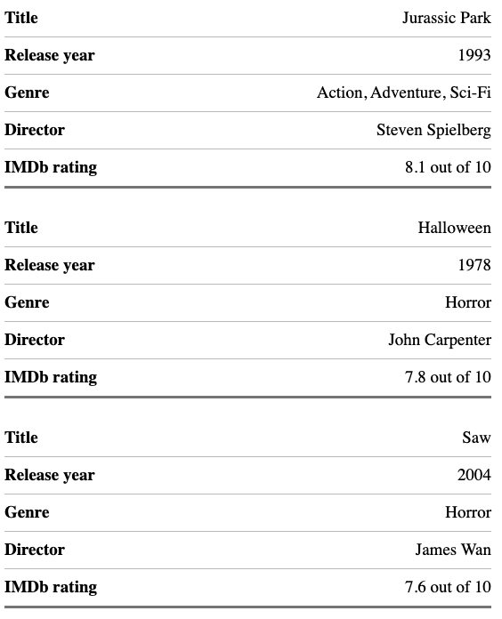

Tables on mobile suck, whether that is through horizontal scrolling or endlessly resizing and hoping it fits on a 320px viewport. Fortunately, I have a way you can solve that problem (in certain scenarios).

## The table

If you want to have a look at the HTML and CSS you can [view on Codepen](https://codepen.io/Fenwick17/pen/RwReYXM) or [view on Github](https://github.com/Fenwick17/responsive-tables/).

When viewed on a destkop the table component will behave like any other table. However, when viewed on a mobile the table collapses into what appears to be a group list style component.

The markup remains the same as it did originally, so when using a screen reader it will still be read out as if it was a normal table just with a different visual representation.

### How it works

Let's start by building our barebones HTML table.  
```
<table class="responsive-table">
  <caption>Table of my favourite movies</caption>
  <thead>
    <tr>
      <th scope="col">Title</th>
      <th scope="col">Release year</th>
      <th scope="col">Genre</th>
      <th scope="col">Director</th>
      <th scope="col">IMDb rating</th>
    </tr>
  </thead>
  <tbody>
    <tr>
      <td>Jurassic Park</td>
      <td>1993</td>
      <td>Action, Adventure, Sci-Fi</td>
      <td>Steven Spielberg</td>
      <td>8.1 out of 10</td>
    </tr>
    <tr>
      <td>Halloween</td>
      <td>1978</td>
      <td>Horror</td>
      <td>John Carpenter</td>
      <td>7.8 out of 10</td>
    </tr>
    <tr>
      <td>The Lord of the Rings: The Two Towers</td>
      <td>2002</td>
      <td>Adventure</td>
      <td>Peter Jackson</td>
      <td>8.7 out of 10</td>
    </tr>
    <tr>
      <td>Anchorman: The Legend of Ron Burgundy</td>
      <td>2004</td>
      <td>Comedy</td>
      <td>Adam McKay</td>
      <td>7.2 out of 10</td>
    </tr>
  </tbody>
</table>
```

And of course our default CSS, nothing fancy here
```
/* Standard table styling, change as desired */
table {
  border-collapse: collapse;
  border-spacing: 0;
}
  
caption { 
  font-size: 24px;
  font-weight: 700;
  text-align: left;
}
  
th {
  border-bottom: 1px solid #bfc1c3;
  font-size: 19px;
  padding: 0.5em 1em 0.5em 0;
  text-align: left;
}
  
td {
  border-bottom: 1px solid #bfc1c3;
  font-size: 19px;
  padding: 0.5em 1em 0.5em 0;
}
```

Now lets get down to the fun stuff and add our responsiveness.
So how does it work? well first of all on mobile we are going to modify our talbe rows to be block level rather than table-row. Since that will break the alignment with the table heading, we can visually hide that too (don't use `display: none` we need this for screen readers). 

```
.responsive-table {
  margin-bottom: 0;
  width: 100%;
}

thead {
  border: 0;
  clip: rect(0 0 0 0);
  -webkit-clip-path: inset(50%);
  clip-path: inset(50%);
  height: 1px;
  margin: 0;
  overflow: hidden;
  padding: 0;
  position: absolute;
  white-space: nowrap;
  width: 1px;
}

tbody tr {
  display: block;
  margin-bottom: 1.5em;
  padding: 0 0.5em;
}

@media (min-width: 768px) {
  tbody tr {
    display: table-row;
  }
}
```

Now we need to get our mobile version remotely resembling a list. To do this we will add `flex` to a our `<td>` which will make a lot more sense a bit later on. I like to add a `border-bottom` to the last `<td>` but this is entirely optional, I just think it breaks things up a bit nicer. And then of course, back to the default `table-cell` on a desktop.

```
tbody tr td {
  display: flex;
  justify-content: space-between;
  min-width: 1px;
  text-align: right;
}

@media (max-width: 768px) {
  tbody tr td {
    padding-right: 0;
  }
  tbody tr td:last-child {
    border-bottom: 3px solid grey;
  }
}

@media (min-width: 768px) {
  tbody tr td {
    display: table-cell;
    text-align: left;
  }
}
```
We changed the `display` styling for `<tr>` and `<td>` which means a screen reader is no longer aware these are still table elements, and therefore does no longer read them out as such. To fix this we will use some HTML roles so that no matter what we do to these elements, a screen reader always recognises them as part of the `<table>`.
We will add `role="row"` to `<tr>` and `role="cell"` to `<td>`. 

```
<tbody>
  <tr role="row">
    <td role="cell">Jurassic Park</td>
    <td role="cell">1993</td>
    <td role="cell">Action, Adventure, Sci-Fi</td>
    <td role="cell">Steven Spielberg</td>
    <td role="cell">8.1 out of 10</td>
  </tr>
  <tr role="row">
    <td role="cell">Halloween</td>
    <td role="cell">1978</td>
    <td role="cell">Horror</td>
    <td role="cell">John Carpenter</td>
    <td role="cell">7.8 out of 10</td>
  </tr>
  <tr role="row">
    <td role="cell">The Lord of the Rings: The Two Towers</td>
    <td role="cell">2002</td>
    <td role="cell">Adventure</td>
    <td role="cell">Peter Jackson</td>
    <td role="cell">8.7 out of 10</td>
  </tr>
  <tr role="row">
    <td role="cell">Anchorman: The Legend of Ron Burgundy</td>
    <td role="cell">2004</td>
    <td role="cell">Comedy</td>
    <td role="cell">Adam McKay</td>
    <td role="cell">7.2 out of 10</td>
  </tr>
</tbody>
```

At this stage it is looking pretty quite good. You have the default table styling on desktop, and a collapsed list view on mobile. But there is a clear problem here, the table headings are gone so we can't see what each cell it meant to mean anymore. Well time to bring those back on mobile.

```
<tbody>
  <tr role="row">
    <td role="cell">
      <span class="responsive-table__heading" aria-hidden="true">Title</span>
      Jurassic Park
    </td>
    <td role="cell"><span class="responsive-table__heading" aria-hidden="true">Release year</span>1993</td>
    <td role="cell"><span class="responsive-table__heading" aria-hidden="true">Genre</span>Action, Adventure, Sci-Fi</td>
    <td role="cell"><span class="responsive-table__heading" aria-hidden="true">Director</span>Steven Spielberg</td>
    <td role="cell"><span class="responsive-table__heading" aria-hidden="true">IMDb rating</span>8.1 out of 10</td>
  </tr>
  <tr role="row">
    <td role="cell"><span class="responsive-table__heading" aria-hidden="true">Title</span>Halloween</td>
    <td role="cell"><span class="responsive-table__heading" aria-hidden="true">Release year</span>1978</td>
    <td role="cell"><span class="responsive-table__heading" aria-hidden="true">Genre</span>Horror</td>
    <td role="cell"><span class="responsive-table__heading" aria-hidden="true">Director</span>John Carpenter</td>
    <td role="cell"><span class="responsive-table__heading" aria-hidden="true">IMDb rating</span>7.8 out of 10</td>
  </tr>
  <tr role="row">
    <td role="cell"><span class="responsive-table__heading" aria-hidden="true">Title</span>The Lord of the Rings: The Two Towers</td>
    <td role="cell"><span class="responsive-table__heading" aria-hidden="true">Release year</span>2002</td>
    <td role="cell"><span class="responsive-table__heading" aria-hidden="true">Genre</span>Adventure</td>
    <td role="cell"><span class="responsive-table__heading" aria-hidden="true">Director</span>Peter Jackson</td>
    <td role="cell"><span class="responsive-table__heading" aria-hidden="true">IMDb rating</span>8.7 out of 10</td>
  </tr>
  <tr role="row">
    <td role="cell"><span class="responsive-table__heading" aria-hidden="true">Title</span>Anchorman: The Legend of Ron Burgundy</td>
    <td role="cell"><span class="responsive-table__heading" aria-hidden="true">Release year</span>2004</td>
    <td role="cell"><span class="responsive-table__heading" aria-hidden="true">Genre</span>Comedy</td>
    <td role="cell"><span class="responsive-table__heading" aria-hidden="true">Director</span>Adam McKay</td>
    <td role="cell"><span class="responsive-table__heading" aria-hidden="true">IMDb rating</span>7.2 out of 10</td>
  </tr>
</tbody>
```
The CSS to go with it: 
```
<!-- CSS -->
.responsive-table__heading {
  font-weight: 700;
  padding-right: 1em;
  text-align: left;
  word-break: initial;
}

@media (min-wdith: 768px) {
  .responsive-table__heading {
    display: none;
  }
}
```

We added a `<span>` which replicates what the heading is for that piece of data, then with the use of `aria-hidden="true"` we hid that from a screenreader. This is because the `<thead>` is still fully functional so it would just be extra noise. However, for visual users it is there to directly show what that piece of data relates to. The CSS simply hides and shows it depending on mobile or desktop.
Remember that `flex` we used before? Well now it comes into full swing, with utilizing `justify-content: space-between` we can seperate the mobile visual heading with the data counterpart.

